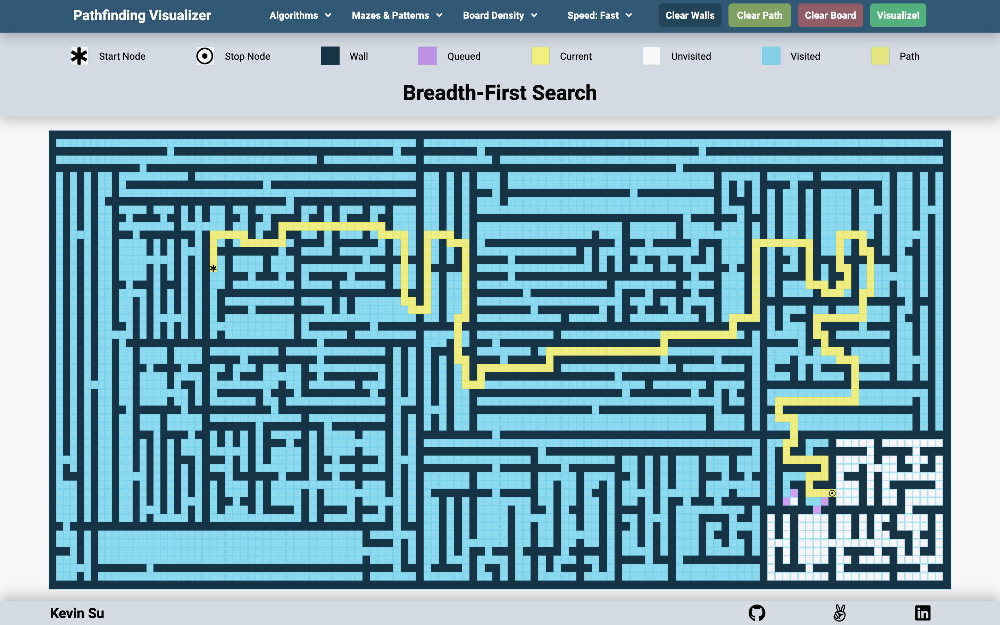
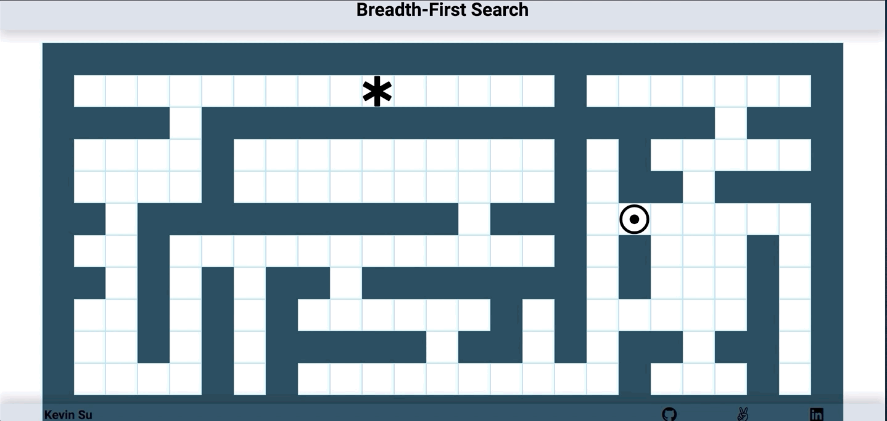

# pathfinding_visualizer



Pathfinding Visualizer helps users understand different pathfinding algorithms on a 2d square grid. Animations, dynamic re-evaluation, and mazes are employed to create a visually stunning and interactive application that is also educative.

## Link to live site:
https://kevinsuboy.github.io/pathfinding_visualizer/

## Technologies Used
- Vanilla JS
- (That's it! Nice and simple)

## How it works
Users can choose from a variety of algorithms, mazes, board densities, and animation speeds to help their understanding of pathfinding visualizers. When the user is ready, they can hit the "visualize" button and the app will begin animating.

### The algorithms
- Dijkstra's Algorithm: finds the shortest path(s) between nodes in a graph
- Breadth-First Search: starts at a root node and explores all neighbor nodes of current nodes
- Depth-First Search: starts at a root node and explores as far as possible along each branch before backtracking

Each algorithm is written with OOP in mind. They are written such that they share similarly named methods and can be executed as the chosen algorithm is dynamically changed. Similarly, each algorithm inherits from a parent class with methods that create connected graphs for the algorithms to use.

```javascript
const { algoParent } = require("./algoParent");

class BFS extends algoParent {
    constructor(gridSize){
        super(gridSize)
    }
    genSearch(/*...*/){
    }
    getShortestPath(/*...*/){
    }
}
```
```javascript
class algoParent {
    constructor(gridSize, initVal=0) {
    }
    genEdges() {
    }
    genGrid() {
    }
    resetGrid() {
    }
    execute(/*...*/) {
        this.genSearch(/*...*/);
        this.getShortestPath(/*...*/);
    }
    move(pos, d) {
    }
    validMove(pos) {
    }
}
```
### Animation
CSS animations, and asynchronous JS functions were used to create stunning animations.



This was done by chaining asynchronous ```setTimeout``` in a recursive function, where the base case is when the number of ```setTimeout``` calls has exceeded the length of the array of nodes that require animation.

When the base case is reached, a callback function is called to animate the shortest path from source to destination.

The pseudocode is as follows:

```javascript
    animateNode(idx,pathAnimate){
        if(idx >= nodesToAnimate.length) return pathAnimate();
        const node = document.getElementById(`${nodesToAnimate[idx]}`)
        node.classList.add("visited")
        window.timeouts.push(
            setTimeout(()=>animateNode(idx+1, pathAnimate),1000)
        )
    }
```
